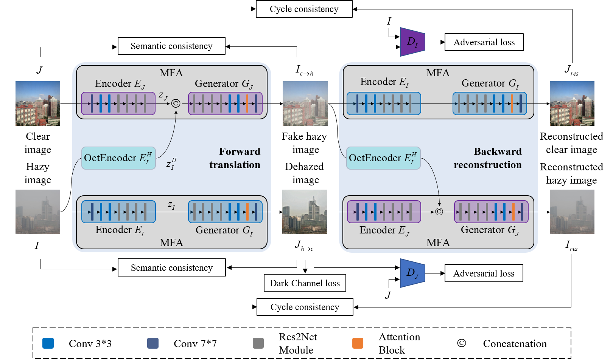

# USID-Net
The Pytorch implementation for "USID-Net: Unsupervised Single Image Dehazing Network via Disentangled Representations".

# Paper

# Prerequisites
Python 3.6

PyTorch 1.3.1

# Quick Start
cd code

python test.py --in_dir hazy_images_path  --output_dir save_path

# Citation
@article{li2022usid,

  title={USID-Net: Unsupervised Single Image Dehazing Network via Disentangled Representations},
  
  author={Li, Jiafeng and Li, Yaopeng and Zhuo, Li and Kuang, Lingyan and Yu, Tianjian},
  
  journal={IEEE Transactions on Multimedia},
  
  year={2022},
  
  publisher={IEEE}
  
}

